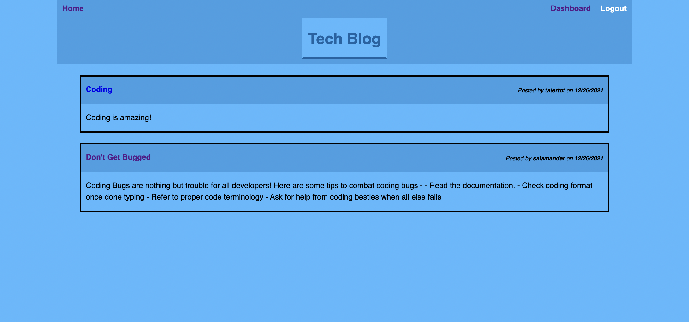
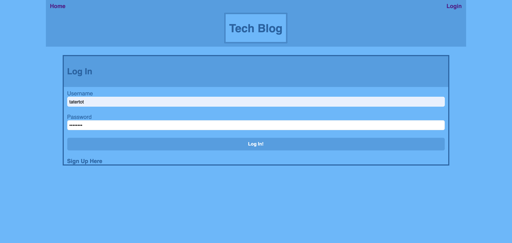
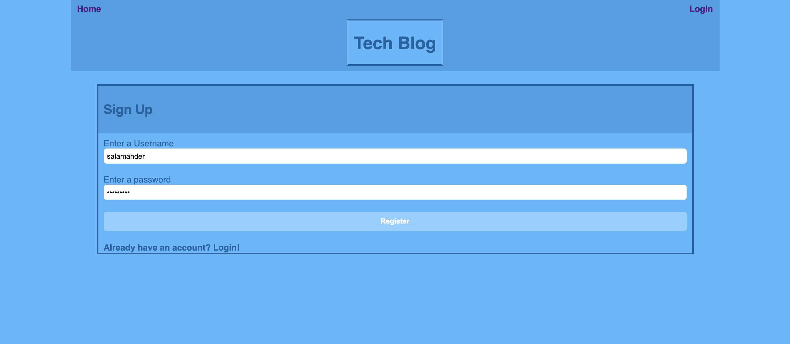
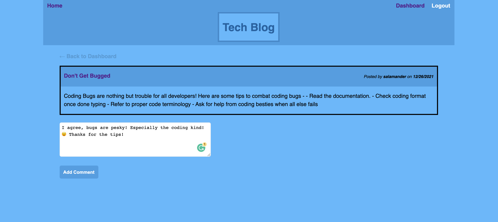
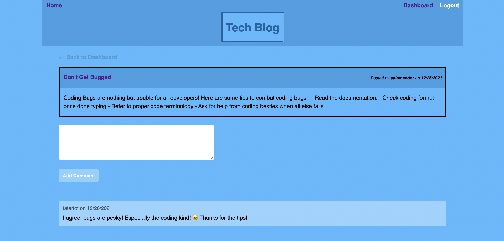
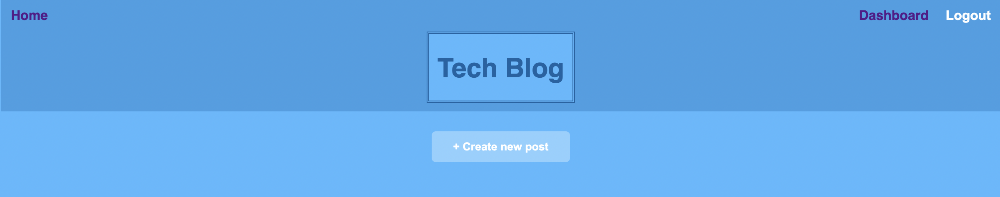
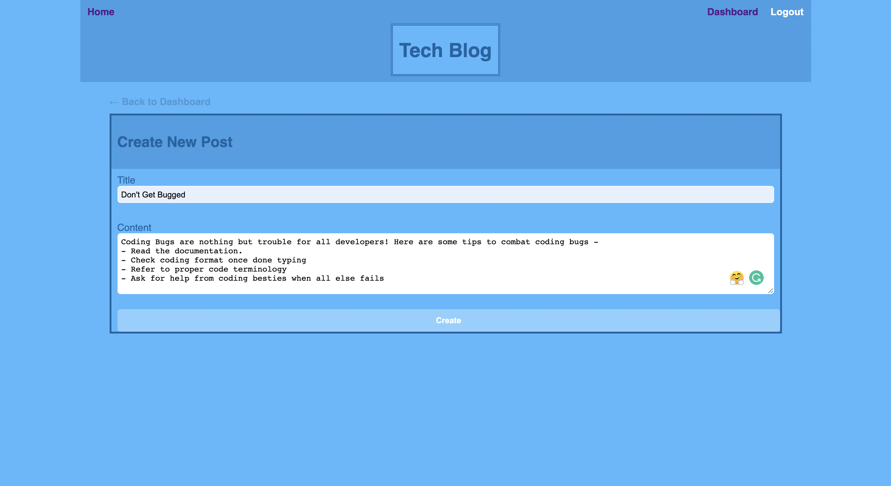
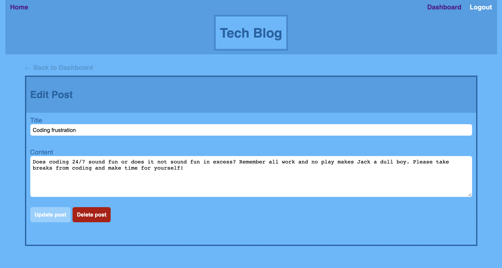

# MVC Tech Blog

Tech Blog is a blogging website that allows user to publish their own posts about tech, coding, and anything else related to the tech world! This is a CMS-style blog that is built with the MVC (model-view-controller) paradigm with Handlebars.js as the HTML template language, Sequelize as the ORM (object-relational mapping), and the Express-Session npm package for user authentication. 

## Description

When users first visit the Tech Blog homepage, they are able to view existing blog posts from the users and can navigate to either to the homepage (Home) or to the login page (Login). Clicking on post links when not logged in just present the visible post and comments. Accessing other links will redirect unlogged users to the login page, where registered users can login. New users are able to register to use Tech Blog by clicking on the Sign Up Here button where they will sign up by entering in a username and password. From there, their user credentials are saved and users are now able to access the website.

When signed in, registered users are able to see the navigation links for the homepage (Home), the dashboard (Dashboard), and to log out of the website (Logout).  The homepage presents the existing blog posts with the post title and post date; users can click on the blog post link where the title, post content, creator's username and date is presented. They also have the option to leave a comment as shown below. Once posted, it will update the post link to display the comment, the comment user's username, and the date when the comment was made.

The dashboard presents the user's content which presents any blog posts they have created and the option to add a new blog post to the site.

When the button to add a new blog post is clicked on the user, the user is able to create their blog post by entering in a title and the content they want to enter. Once completed, the user can submit their blog post by clicking on the Create button. Their blog post is saved and the user is then taken back to the updated dashboard with their new post present.

When accessing an existing user-made post on the dashboard, the user is able to delete or update their existing post where it will take the user back to an updated dashboard.

## Table of Contents
- [Description](#Description)
- [Installation](#Installation)
- [Usage](#Usage)
- [Developed With](#Developed-With)
- [Developer Notes and Further Ideas](#Developer-Notes-and-Further-Ideas)

## Installation
Although the link is deployed to Heroku, the following steps below are listed in case to review the database, models, and the seed files demonstrating the site functionality.

- The following npm packages listed in the `Developed With` tab are required to install in order to access and demonstrate the routes of the database.
- This file can be cloned through GitHub into your own repository by selecting the above Code button.
- To view the database through MySQL, please type `mysql -u root -p`. Please note that with the dotenv package, you will need to add your MySQL password in the respective .env file and add it to the .gitignore file in order to prevent confidental information from leaking.
- When in the MySQL command line, source the database by entering `source db/schema.sql;`.
- Then, `npm run seeds` to seed the file and obtain data to generate when viewing the posts, comments, and users of Tech Blog.
- Start the server by entering `node server.js` and visit the localhost:3001 link to view the seeds file within the Tech Blog webpage.

## Usage
The URL of the functional, deployed application on Heroku.
https://vast-brushlands-11504.herokuapp.com/

The URL of the GitHub repository. 
https://github.com/trujilml/mvc-tech-blog

## Developed With
The application follows the Model-View-Controller paradigm.
- Express-Handlebars - Handlebars.js package used with Express to generate HTML pages and render content from the database and models. Views in the MVC paradigm. -  https://www.npmjs.com/package/express-handlebars
- MySQL2 - Continuation package of MySQL. Relational database management system that ensures fast connection to host servers and web databases. MySQL2 is used with the MVC to connect to the Model databases alongside the use of Sequelize. - https://www.npmjs.com/package/mysql2
- Sequelize - Promise-based Node.js ORM for the MySQL server. Used alongside MySQL2 to connect with the database to the Model databases. - https://sequelize.org/
- Express.js API - Web framework for Node.js, connected with MySQL 2 and Sequelize. The Controllers for the MVC paradigm that demonstrates the routes connected with the models and database - https://expressjs.com/

- dotenv - An npm package that protects and stores login credentials from other users through the .env file and MySQL2. - https://www.npmjs.com/package/dotenv
- bcrypt - An npm package used to hash the passwords from users. - https://www.npmjs.com/package/bcrypt
- express-session - Node.js module/npm package that stores session data on the client in a cookie (viewed in Inspect/Application when using Google Developer Tools). When time on the site is idle (for this application, after 30 minutes - `view server.js file`), the cookie will expire and the user will have to log in again to start a new session. -  https://www.npmjs.com/package/express-session 
- connect-session-sequelize - A SQL session storage using Sequelize to authenticate a user's session on the webpage. Syncs and stores session time and allows for expiration of cookies time when used alongside express-session. - https://www.npmjs.com/package/connect-session-sequelize

These were the programs used to test and generate the web link prior to and after its deployment.
- Insomnia - Collaborative API Client and Design Tool used to build and test APIs with an active server. Was used to test format of the webpage with sample models and later seed files to present on the webpage. - https://insomnia.rest/products/insomnia
- Heroku - Cloud platform used to deploy this application in a web link from its respective CLI. 
- JawsDB MySQL - A Heroku add-on for providing a fully functional MySQL Database server for use with this application. Helped generate databases and server to start the deployed website.

-  Nodemon - Tool that helps develop node.js applications by automatically restarting the node application when file changes are detected. Helped with site testing and seed files. - https://www.npmjs.com/package/nodemon 
- JavaScript - Front-end and Back-end development
- Node.js - Back-end development
- CSS - Front-end development, used with HTML and Handlebars to generate site design
- HTML - Front-end development, used with Handlebars to generate site format and CSS to generate site design and its responsive format

## Developer Notes and Further Ideas
- Developer Notes
Seed files of the Comment, User, and Post model were added for testing purposes to test the website's functionality. To view and test the Seed files, review the [Installation](#Installation) tab above. 

- Further Ideas
Comments on Tech Blog can only be added. They cannot be deleted or edited as this time. This is considered for a future site implementation.